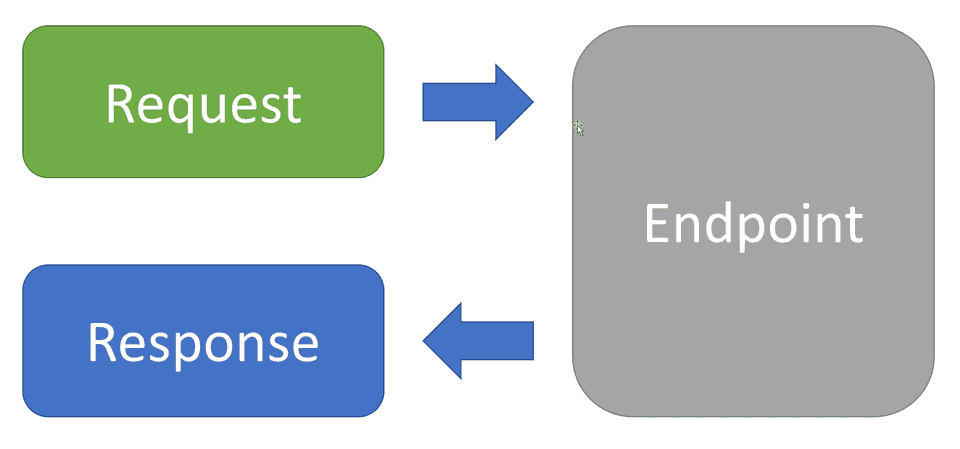

# 📌 Livemap-web 
---
| CI                | status                                                                                                                                                                                                    |
|-------------------|-----------------------------------------------------------------------------------------------------------------------------------------------------------------------------------------------------------|
| .NET              | [](https://github.com/STU-GroupI/LiveMap-Web/actions/workflows/ci-dotnet.yml)                                 |
| .NET Build & Test | [](https://github.com/STU-GroupI/LiveMap-Web/actions/workflows/ci-tests_coverage.yml)    |
| Roslyn Analyzer   | [](https://github.com/STU-GroupI/LiveMap-Web/actions/workflows/ci-roslyn_analyzers.yml) |
| Tailwind/Preline  | [](https://github.com/STU-GroupI/LiveMap-Web/actions/workflows/ci-tailwind.yml)               |


## 🚩 Structure

```markdown
│── Livemap.Api                 # Api controllers and endpoints
│── Livemap.Application         # Application layer, contains all the business logic
│── Livemap.Domain              # Domain layer, contains all the domain entities and value objects
│── Livemap.Infrastructure      # Infrastructure layer, contains all the logic to connect the web app to the API
│── Livemap.Persistence         # Persistence layer, contains all the database related code
│── Livemap.Tests               # Tests layer, contains all the tests
│── Livemap.Web                 # Web layer, contains all the web related code
```

## 🧪 Architecture

Please reference the bases of clean architecture and REPR architecture for more
information on the current layout of the project


 